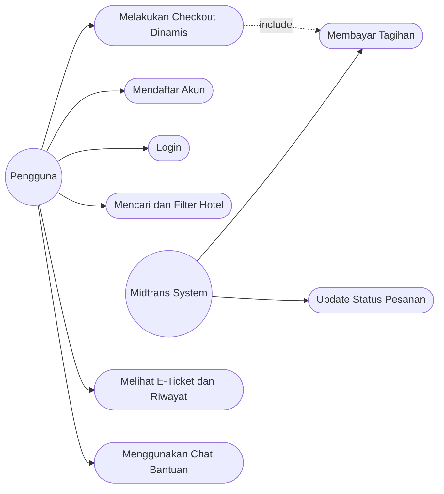
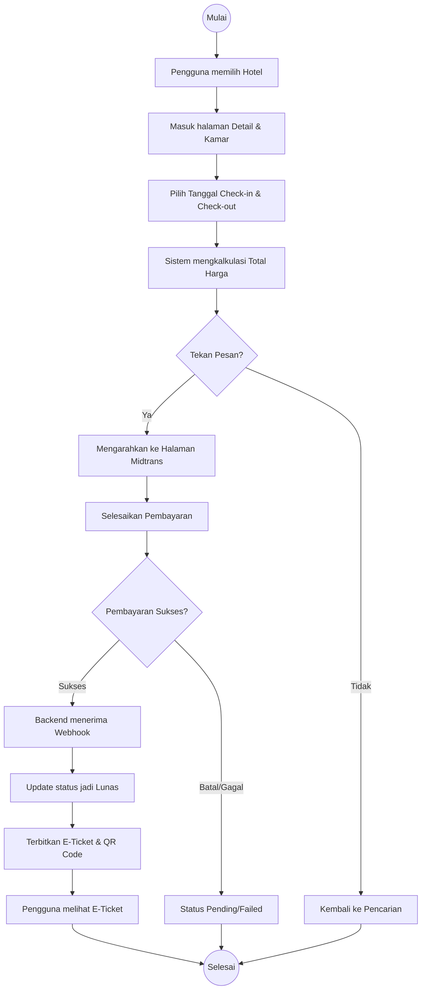
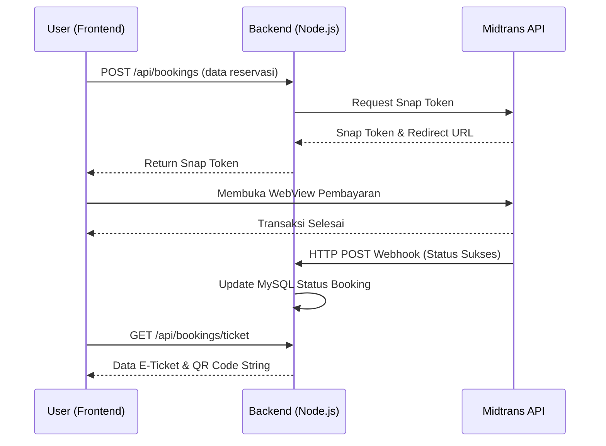
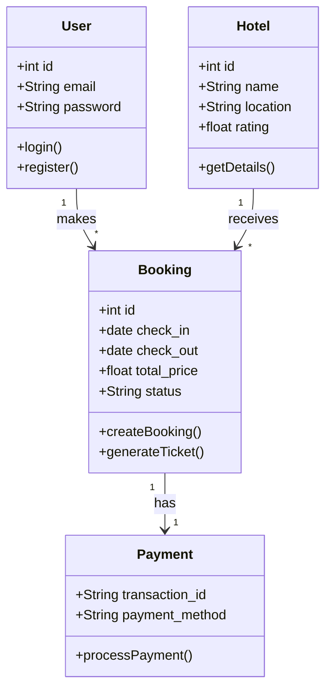
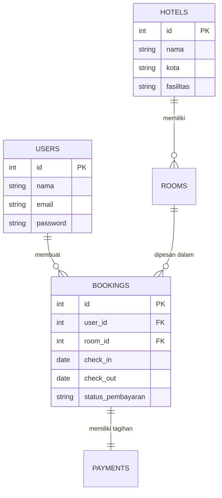

# PROPOSAL APLIKASI BOOKING HOTEL (STAYLUX)

**HALAMAN JUDUL**
**PROPOSAL PENGEMBANGAN SISTEM INFORMASI**
**APLIKASI MOBILE BOOKING HOTEL "STAYLUX" BERBASIS REACT NATIVE DAN NODE.JS**

---

## KATA PENGANTAR

Puji dan syukur senantiasa dipanjatkan ke hadirat Tuhan Yang Maha Esa, karena atas rahmat dan karunia-Nya, penyusunan proposal pengembangan aplikasi mobile yang berjudul "Aplikasi Mobile Booking Hotel 'StayLux' Berbasis React Native dan Node.js" ini dapat diselesaikan dengan baik. Proposal ini disusun sebagai kerangka acuan dan rancangan awal dalam mengembangkan sebuah sistem pemesanan akomodasi perhotelan yang modern, efisien, dan terintegrasi dengan sistem pembayaran digital.

Penulis menyadari bahwa proses perancangan dan pengembangan aplikasi ini membutuhkan landasan teoritis serta metodologi yang kuat. Oleh karena itu, proposal ini menjabarkan secara komprehensif mulai dari latar belakang masalah, tinjauan pustaka, hingga metodologi pengembangan sistem yang akan digunakan. Aplikasi StayLux dirancang untuk menjawab tantangan digitalisasi di sektor pariwisata dan perhotelan, khususnya dalam memberikan kemudahan bagi pengguna (*end-user*) untuk melakukan transaksi secara aman dan mendapatkan tiket elektronik secara *real-time*.

Penulis mengucapkan terima kasih kepada semua pihak yang telah memberikan dukungan, bimbingan, maupun referensi dalam penyusunan proposal ini. Penulis menyadari bahwa proposal ini masih jauh dari kata sempurna. Oleh karena itu, kritik dan saran yang membangun sangat diharapkan untuk penyempurnaan di masa yang akan datang.

---

## DAFTAR ISI

1. Halaman Judul
2. Kata Pengantar
3. Daftar Isi
4. BAB I PENDAHULUAN
    - 1.1 Latar Belakang
    - 1.2 Rumusan Masalah
    - 1.3 Tujuan
    - 1.4 Manfaat
    - 1.5 Batasan Masalah
5. BAB II TINJAUAN PUSTAKA
    - 2.1 Kajian Teori
    - 2.2 Penelitian Terdahulu
    - 2.3 Kerangka Berpikir
6. BAB III METODOLOGI
    - 3.1 Metode Pengembangan
    - 3.2 Tahapan Pengembangan
    - 3.3 Analisis Kebutuhan
    - 3.4 Perancangan Sistem
    - 3.5 Perancangan Antarmuka (UI)
    - 3.6 Pengujian Sistem
7. BAB IV RENCANA IMPLEMENTASI
    - 4.1 Jadwal Pengerjaan
    - 4.2 Software yang Digunakan
    - 4.3 Hardware yang Digunakan
8. BAB V PENUTUP
    - 5.1 Kesimpulan
    - 5.2 Saran
9. Daftar Pustaka
10. Lampiran

---

## BAB I PENDAHULUAN

### 1.1 Latar Belakang
Di era globalisasi dan transformasi digital yang melaju dengan sangat pesat, teknologi informasi telah menjadi tulang punggung bagi berbagai sektor industri, tidak terkecuali pada sektor pariwisata dan perhotelan. Masyarakat modern menuntut kemudahan, kecepatan, dan efisiensi dalam setiap aspek kehidupan, termasuk dalam merencanakan perjalanan dan memesan akomodasi. Mobilitas masyarakat yang tinggi memicu pergeseran tren dari pemesanan hotel secara konvensional (melalui telepon atau datang langsung) menuju pemesanan secara daring (online) melalui perangkat telepon pintar (*smartphone*).

Kebutuhan akan aplikasi pemesanan hotel yang interaktif dan responsif semakin meningkat. Pengguna membutuhkan sebuah platform yang tidak hanya mampu menampilkan daftar hotel, tetapi juga menyediakan informasi detail mengenai fasilitas, ulasan pengguna lain, serta perbandingan harga yang transparan. Selain itu, keamanan dalam bertransaksi juga menjadi faktor krusial yang menentukan kepercayaan pengguna terhadap sebuah platform pemesanan daring.

Menyikapi fenomena tersebut, diusulkanlah pengembangan aplikasi bernama "StayLux". StayLux dirancang sebagai aplikasi *mobile booking hotel* profesional yang dibangun di atas teknologi React Native (Expo) untuk sisi antarmuka klien (*frontend*), serta Node.js dan basis data MySQL untuk sistem pengolahan data (*backend*). Keunggulan utama dari aplikasi ini terletak pada integrasi sistem *payment gateway* menggunakan Midtrans, yang memungkinkan pemrosesan pembayaran dilakukan secara otomatis dan *real-time*. Setelah transaksi dinyatakan berhasil, sistem akan secara otomatis menerbitkan tiket elektronik (*E-Ticket*) yang dilengkapi dengan kode QR (QR Code) sebagai bukti reservasi yang sah, sehingga meminimalisir penggunaan kertas (*paperless*) dan mempercepat proses *check-in* di hotel.

### 1.2 Rumusan Masalah
Berdasarkan latar belakang yang telah diuraikan, maka rumusan masalah dalam perancangan dan pengembangan sistem ini adalah sebagai berikut:
1. Bagaimana menganalisis dan merancang antarmuka pengguna aplikasi pemesanan hotel (StayLux) yang intuitif dan responsif dengan menggunakan React Native?
2. Bagaimana cara mengintegrasikan *Application Programming Interface* (API) dari *payment gateway* pihak ketiga (Midtrans) secara aman ke dalam arsitektur aplikasi agar dapat memproses berbagai metode pembayaran secara otomatis?
3. Bagaimana merancang sistem *backend* berbasis Node.js dan MySQL yang mampu menghasilkan dan memvalidasi *E-Ticket* berbasis QR Code secara *real-time* setelah pengguna berhasil melakukan pembayaran?

### 1.3 Tujuan
Adapun tujuan dari pengembangan aplikasi StayLux ini adalah:
1. Membangun aplikasi perangkat bergerak (*mobile application*) untuk layanan pemesanan kamar hotel yang memberikan pengalaman pengguna (*User Experience/UX*) yang mulus dari proses pencarian hingga *checkout*.
2. Mengimplementasikan sistem *payment gateway* (Midtrans) pada aplikasi untuk mendukung pemrosesan transaksi keuangan digital secara *real-time*, valid, dan aman.
3. Menciptakan sistem otomatisasi penerbitan tiket elektronik (*E-Ticket*) yang terintegrasi dengan teknologi QR Code untuk mempermudah identifikasi dan verifikasi reservasi di pihak hotel.

### 1.4 Manfaat
Pengembangan aplikasi ini diharapkan dapat memberikan manfaat sebagai berikut:
1. **Bagi Pengguna (Masyarakat):** Mempermudah proses pencarian dan pemesanan kamar hotel di mana saja dan kapan saja, serta memberikan rasa aman melalui metode pembayaran digital yang diakui dan konfirmasi instan.
2. **Bagi Pihak Hotel:** Membantu digitalisasi proses reservasi, memperluas jangkauan pasar, dan mempercepat proses administrasi resepsionis melalui fitur *scan* QR Code.
3. **Bagi Pengembang/Peneliti:** Menjadi wadah implementasi keilmuan Rekayasa Perangkat Lunak, khususnya dalam penggunaan teknologi terkini seperti React Native, Node.js, Express.js, dan integrasi API pembayaran.

### 1.5 Batasan Masalah
Untuk menjaga agar ruang lingkup pengembangan tetap fokus dan terarah, batasan masalah pada pengembangan aplikasi ini meliputi:
1. Aplikasi dibangun dalam wujud aplikasi *mobile* dan ditargetkan dapat berjalan pada sistem operasi Android melalui kerangka kerja React Native (Expo).
2. Sistem *backend* dibangun menggunakan Node.js (Express.js) dan sistem manajemen basis data relasional MySQL.
3. Simulasi *payment gateway* menggunakan lingkungan pengujian (Sandbox) dari layanan Midtrans, yang mencakup metode pembayaran umum seperti *Virtual Account* (VA) dan dompet digital (E-Wallet).
4. Aplikasi difokuskan pada alur utama pemesanan (pencarian, pemilihan kamar, penentuan tanggal dengan kalkulasi dinamis, pembayaran, dan penerbitan *E-Ticket*), manajemen profil pengguna, dan obrolan secara *real-time* (chat). Panel *dashboard* administrasi bagi pihak pemilik hotel secara komprehensif tidak masuk dalam rilis versi pertama ini.

---

## BAB II TINJAUAN PUSTAKA

### 2.1 Kajian Teori
1. **Aplikasi Mobile (Mobile Application):** Perangkat lunak yang dirancang khusus untuk beroperasi pada perangkat bergerak seperti telepon pintar dan komputer tablet. Aplikasi *mobile* memberikan keuntungan berupa aksesibilitas yang tinggi dan kemampuan memanfaatkan fitur bawaan perangkat (seperti lokasi dan kamera).
2. **React Native dan Expo:** React Native adalah *framework* sumber terbuka yang dibuat oleh Meta Platforms, yang memungkinkan pengembang untuk membuat aplikasi Android dan iOS menggunakan bahasa pemrograman JavaScript/TypeScript dan sintaksis React. Expo adalah serangkaian perangkat bantu (tools) dan layanan yang dibangun di sekitar React Native yang mempermudah proses inisialisasi, pengujian, dan publikasi aplikasi tanpa perlu berurusan dengan kode asli (*native code*) yang rumit.
3. **Node.js dan Express.js:** Node.js adalah lingkungan eksekusi JavaScript yang bekerja pada sisi peladen (server-side), bersifat *asynchronous* dan *event-driven*. Express.js adalah kerangka kerja web untuk Node.js yang minimalis dan fleksibel, sangat ideal untuk membangun *Representational State Transfer Application Programming Interface* (REST API).
4. **Payment Gateway:** Sistem layanan transaksi keuangan yang berfungsi sebagai pintu gerbang (*gateway*) untuk menjembatani dan mengotorisasi proses pembayaran antara aplikasi milik *merchant* dengan berbagai instansi perbankan atau penyedia dompet digital.
5. **QR Code (Quick Response Code):** Barcode dua dimensi yang dapat menyimpan berbagai jenis informasi, seperti teks atau URL, yang dapat dipindai dengan cepat oleh perangkat pembaca digital untuk proses verifikasi.

### 2.2 Penelitian Terdahulu
Berbagai penelitian yang relevan dengan pengembangan sistem ini telah dilakukan sebelumnya. Sebuah studi mengenai "Rancang Bangun Sistem Informasi Pemesanan Kamar Hotel Berbasis Android" menyimpulkan bahwa penggunaan aplikasi *mobile* memperpendek waktu tunggu pemesanan hingga 60% dibandingkan metode konvensional. Penelitian lain terkait "Integrasi API Midtrans untuk Sistem Pembayaran E-Commerce" menunjukkan bahwa penggunaan *payment gateway* pihak ketiga meningkatkan tingkat keberhasilan transaksi (success rate) serta menjamin keamanan enkripsi data pembayaran pengguna. Penelitian-penelitian tersebut menjadi landasan bahwa kombinasi aplikasi *mobile* dengan pembayaran pihak ketiga merupakan solusi yang sangat efektif.

### 2.3 Kerangka Berpikir
Kerangka berpikir dalam perancangan sistem ini dimulai dari identifikasi masalah (proses pemesanan hotel yang rumit dan tidak transparan) menuju pada solusi berbasis teknologi. Pengguna membutuhkan wadah untuk mencari hotel, sehingga sistem menyediakan modul pencarian dan filter. Sistem membutuhkan kepastian transaksi, sehingga diterapkan API Midtrans. Untuk membuktikan transaksi berhasil, sistem merender QR Code ke dalam *E-Ticket*. Keseluruhan proses ini dikelola oleh REST API berbasis Express.js yang bertukar data (dalam format JSON) dengan *frontend* React Native.

---

## BAB III METODOLOGI

### 3.1 Metode Pengembangan
Metode pengembangan perangkat lunak yang digunakan dalam proyek aplikasi StayLux adalah *System Development Life Cycle* (SDLC) dengan model *Waterfall* (Air Terjun). Pemilihan metode ini didasarkan pada karakteristik proyek yang memiliki alur logika dan kebutuhan sistem yang sudah didefinisikan secara jelas sejak awal (seperti alur pencarian, *checkout*, hingga penerbitan tiket). Pendekatan terstruktur ini memastikan kualitas arsitektur sistem terjaga.

### 3.2 Tahapan Pengembangan
Metode *Waterfall* yang diterapkan meliputi tahapan-tahapan berurutan sebagai berikut:
1. **Analisis Kebutuhan (Requirements Analysis):** Mengumpulkan spesifikasi fungsional (fitur-fitur aplikasi) dan non-fungsional (performa, keamanan) melalui studi literatur dan observasi sistem serupa.
2. **Desain Sistem (System Design):** Menerjemahkan spesifikasi ke dalam bentuk cetak biru (blueprint) perancangan, yang mencakup desain antarmuka (UI/UX), pemodelan basis data (ERD), dan pemodelan alur perangkat lunak menggunakan UML (*Unified Modeling Language*).
3. **Implementasi (Implementation):** Tahap penulisan kode sumber (*coding*). *Frontend* dikerjakan dengan TypeScript dan React Native, sedangkan *Backend* dikerjakan dengan Node.js dan MySQL, beserta instalasi pustaka seperti *socket.io* dan *axios*.
4. **Pengujian (Testing):** Proses verifikasi untuk memastikan bahwa setiap komponen sistem berjalan sesuai desain dan bebas dari galat (*bug/error*).
5. **Pemeliharaan (Maintenance):** Pembaruan rutin pasca-rilis guna menangani masalah yang mungkin baru muncul setelah digunakan secara luas.

### 3.3 Analisis Kebutuhan (Fungsional dan Non-Fungsional)
**Kebutuhan Fungsional:**
- Sistem harus memungkinkan pengguna mendaftarkan akun baru dan melakukan masuk akun (Login) dengan aman.
- Sistem harus menampilkan daftar hotel dan memungkinkan pengguna memfilter berdasarkan harga, kota, dan rating.
- Sistem harus mengkalkulasi harga reservasi secara dinamis saat pengguna memilih rentang tanggal masuk dan keluar pada kalender.
- Sistem harus dapat berkomunikasi dengan API Midtrans untuk memunculkan antarmuka pilihan pembayaran secara *native WebView*.
- Sistem harus dapat men-generate QR Code *E-Ticket* yang dapat disimpan pengguna dalam menu *My Bookings*.
- Sistem harus menyediakan sarana percakapan (*chat*) untuk sarana bantuan.

**Kebutuhan Non-Fungsional:**
- **Kinerja (Performance):** Aplikasi *mobile* harus merespons interaksi antarmuka maksimal dalam 2 detik untuk menghindari *lag*.
- **Keamanan (Security):** Kata sandi pengguna harus dienkripsi (misalnya menggunakan *bcrypt*) di dalam basis data. Jalur API harus dilindungi dengan metode autentikasi JSON Web Token (JWT).
- **Usability:** Antarmuka harus didesain dengan konsep material dan gradien (menggunakan Expo Linear Gradient) agar modern, ramah pengguna, serta navigasi yang jelas (Expo Router).

### 3.4 Perancangan Sistem

Dalam perancangan ini, alur logika digambarkan menggunakan notasi grafis Diagram.

#### A. Use Case Diagram
Menggambarkan interaksi antara aktor (Pengguna) dengan fungsionalitas sistem aplikasi StayLux.

#### B. Activity Diagram (Alur Pemesanan/Booking)
Menjelaskan aliran aktivitas pengguna dari memilih kamar hingga mendapatkan tiket.

#### C. Sequence Diagram (Proses Pembayaran)
Menunjukkan interaksi antar objek (Frontend, Backend, Midtrans).

#### D. Class Diagram
Menggambarkan struktur kelas pada sisi backend.

#### E. Entity Relationship Diagram (ERD)
Memetakan entitas relasional di MySQL.

#### F. Flowchart (Penerbitan E-Ticket)
Algoritma dasar verifikasi tiket.
1. Mulai
2. Cek status `payment_status` dari database.
3. Jika status == 'settlement' atau lunas, kumpulkan data `booking_id` dan tanggal.
4. Lakukan proses *hashing* / pembentukan *string* QR Code.
5. Kembalikan data QR Code ke klien.
6. Selesai.

### 3.5 Perancangan Antarmuka (UI)
Antarmuka sistem (UI) dirancang dengan memprioritaskan estetika dan hierarki informasi.
- **Halaman Utama (Home):** Menampilkan sapaan pengguna, *search bar*, kategori hotel, dan daftar hotel populer dalam bentuk kartu (*HotelCard*) dengan efek bayangan yang elegan.
- **Halaman Detail Hotel:** Berisi gambar *carousel* fasilitas hotel, peta lokasi, ulasan pengguna, dan tombol "Pilih Kamar" yang menempel pada bagian bawah layar (*sticky footer*).
- **Halaman Checkout:** Menampilkan rangkuman kamar, *date-picker* berbentuk kalender yang interaktif, dan rincian harga.
- **Halaman E-Ticket:** Halaman dengan latar belakang cerah bergradien yang menampilkan kode QR besar di tengah, rincian *check-in*, nama tamu, dan tombol unduh tiket.

### 3.6 Pengujian Sistem
Metode pengujian yang diterapkan adalah **Black-Box Testing**, yang mana pengujian berfokus pada fungsionalitas input dan output tanpa memeriksa kode struktur internal.
Skenario yang diuji meliputi:
1. Input formulir pendaftaran dengan format email yang salah (Sistem harus menolak).
2. Pemilihan rentang tanggal di masa lalu (Sistem harus memblokir tanggal tersebut di UI kalender).
3. Pengujian respon transaksi Midtrans di lingkungan *Sandbox* menggunakan nomor kartu kredit virtual (Sistem harus berhasil mengubah status menjadi Lunas).

---

## BAB IV RENCANA IMPLEMENTASI

### 4.1 Jadwal Pengerjaan
Proses pengembangan aplikasi StayLux direncanakan memakan waktu 4 bulan.

| Kegiatan | Bulan 1 | Bulan 2 | Bulan 3 | Bulan 4 |
| :--- | :---: | :---: | :---: | :---: |
| Analisis & Studi Pustaka | X | | | |
| Perancangan Sistem & UI/UX | X | X | | |
| Pemrograman Frontend & Backend | | X | X | |
| Integrasi API (Midtrans) & Testing | | | X | X |
| Dokumentasi & Pemeliharaan | | | | X |

### 4.2 Software yang Digunakan
Perangkat lunak yang diimplementasikan dalam pengembangan proyek ini:
- **Sistem Operasi:** Windows 10/11 atau macOS.
- **Teks Editor / IDE:** Visual Studio Code.
- **Runtime Environment:** Node.js v18+.
- **Frontend Tools:** Expo CLI, React Native Debugger.
- **Database Server:** XAMPP (MySQL) atau MySQL Workbench.
- **API Testing:** Postman (untuk menguji *endpoint* backend).

### 4.3 Hardware yang Digunakan
Untuk memastikan proses *render* emulator dan peladen lokal berjalan lancar, dibutuhkan spesifikasi minimum:
- **Prosesor:** Intel Core i5 / AMD Ryzen 5 (atau setara).
- **RAM:** Minimal 8 GB (Direkomendasikan 16 GB untuk menjalankan emulator).
- **Penyimpanan:** SSD minimal 256 GB.
- **Perangkat Pengujian Fisik:** *Smartphone* Android atau iOS dengan aplikasi Expo Go terinstal (berada di jaringan lokal yang sama dengan PC).

---

## BAB V PENUTUP

### 5.1 Kesimpulan
Berdasarkan seluruh rancangan dan metodologi yang telah dijabarkan, aplikasi StayLux berpotensi kuat untuk menjadi solusi pemesanan hotel modern yang sangat mumpuni. Pemanfaatan *framework* React Native memastikan antarmuka yang sangat responsif, setara dengan aplikasi *native* pada umumnya, sedangkan penggunaan Node.js dan ekosistem Midtrans di sisi peladen memberikan keandalan dalam menangani transaksi moneter pengguna. Proses automasi E-Ticket dengan QR Code terbukti akan mempersingkat birokrasi pemesanan hotel konvensional secara signifikan.

### 5.2 Saran
Beberapa saran untuk pengembangan penelitian dan penyempurnaan sistem di masa depan meliputi:
1. Pengembangan aplikasi untuk sisi *Admin Hotel* (panel manajemen kamar dan inventaris) sehingga keseluruhan siklus bisnis dapat terkontrol dalam satu ekosistem yang sama.
2. Penambahan fitur analitik data untuk memberikan rekomendasi hotel berbasis kecerdasan buatan (AI) yang disesuaikan dengan preferensi pengguna.
3. Eksplorasi pengujian menggunakan arsitektur *microservices* pada backend jika beban data pengguna di masa depan semakin tinggi.

---

## DAFTAR PUSTAKA

1. Pressman, R. S. (2015). *Software Engineering: A Practitioner's Approach (8th ed.)*. McGraw-Hill Education.
2. Facebook Open Source. (2024). *React Native Documentation*. Diakses dari https://reactnative.dev/
3. Midtrans. (2024). *Midtrans Snap API Integration Guide*. Diakses dari https://docs.midtrans.com/
4. Node.js Foundation. (2024). *Node.js Official Documentation*. Diakses dari https://nodejs.org/
5. Supriyanto, A. (2022). *Rancang Bangun Sistem Informasi Reservasi Hotel Berbasis Mobile*. Jurnal Teknik Informatika, 14(2), 112-120.

---

## LAMPIRAN
*(Dokumen lampiran seperti *screenshot* sementara desain UI (*mockup*), daftar struktur tabel database (SQL schema), dan contoh struktur JSON dari API Response akan dilampirkan pada dokumen tercetak final).*
